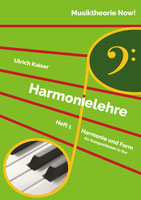

# OpenBook 'Harmonielehre. Harmonie und Form' (Heft 1)

Citation: Ulrich Kaiser, Musiktheorie Now! Harmonielehre. Harmonie und Form für Kompositionen in Dur (= OpenBook 8), Karlsfeld 2014.

## License

Licensed under [Creative Commons Attribution-ShareAlike 3.0 Unported](http://creativecommons.org/licenses/by-sa/3.0/legalcode), please fork this repository in order to create pull requests.   

##Changelog   

Initial Version: 1.0.0  